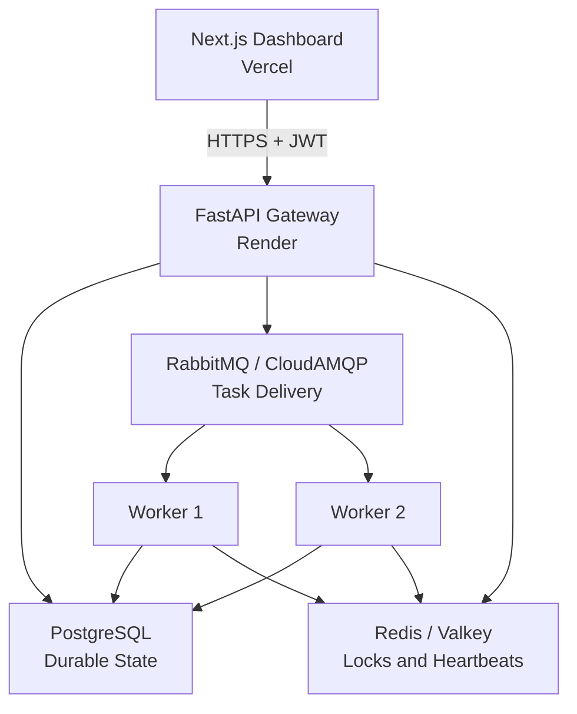

# RelayFlow — Distributed Workflow Orchestration Platform

[](https://github.com/Shaambhavi58/RelayFlow-FullStack/actions/workflows/ci.yml)
[](https://relay-flow-full-stack.vercel.app)
[](https://relayflow-api.onrender.com/health)
[](https://www.python.org/)
[](https://nextjs.org/)

RelayFlow is a distributed workflow orchestration platform inspired by Temporal, Apache Airflow, GitHub Actions and Trigger.dev.

It executes dependency-based task graphs across asynchronous workers while maintaining durable workflow state, retry history, execution logs, worker health and operational metrics.

## Live Deployment

- **Dashboard:** [https://relay-flow-full-stack.vercel.app](https://relay-flow-full-stack.vercel.app)
- **API health:** [https://relayflow-api.onrender.com/health](https://relayflow-api.onrender.com/health)
- **Swagger API documentation:** [https://relayflow-api.onrender.com/docs](https://relayflow-api.onrender.com/docs)
- **Prometheus metrics:** [https://relayflow-api.onrender.com/metrics](https://relayflow-api.onrender.com/metrics)

> The Render free instance can sleep after inactivity. The first request may take approximately 30–60 seconds while the service starts.

Production credentials are not stored in this repository.

## Key Features

### Workflow orchestration

- Directed acyclic graph validation
- Dependency-aware task scheduling
- Parallel execution of independent tasks
- Failure propagation through dependent tasks
- Workflow and task execution history
- Configurable retry policies
- Exponential retry backoff
- Dead-letter queue for permanently failed tasks

### Distributed execution

- RabbitMQ durable task delivery
- Multiple asynchronous worker processes
- PostgreSQL-backed task ownership
- Atomic worker claims using `FOR UPDATE SKIP LOCKED`
- Expiring execution leases
- Worker crash recovery
- Idempotent workflow triggers
- Task uniqueness constraints
- At-least-once message-delivery semantics

### Coordination and observability

- Redis distributed trigger locks
- Expiring worker heartbeats
- Queue-depth monitoring
- Worker-health reporting
- Structured execution events
- Server-Sent Events for live updates
- Prometheus-compatible metrics
- Workflow duration and success-rate tracking

### Security

- JWT access and refresh tokens
- Password hashing
- Admin, Developer and Viewer roles
- Endpoint-level role-based access control
- Protected workflow operations
- Configurable CORS origins
- Secrets supplied through environment variables
- No production credentials included in frontend bundles

### Dashboard

- Live workflow statistics
- Queue-health monitoring
- Worker fleet status
- Execution history
- Workflow DAG visualization
- Workflow builder
- Task dependency selection
- Live backend connection indicator
- Secure login and session handling
- Offline demonstration fallback

## Architecture



PostgreSQL is the source of truth. RabbitMQ notifies workers that work is available, but a worker must atomically claim the corresponding PostgreSQL task before executing it.

This prevents two workers from owning the same task simultaneously. If a worker crashes, its lease expires and another worker can safely reclaim the task.

## Technology Stack

### Frontend

- Next.js
- React
- TypeScript
- React Flow
- Recharts
- Lucide React
- CSS
- Vercel

### Backend

- FastAPI
- Python 3.12
- SQLAlchemy
- PostgreSQL
- RabbitMQ
- Redis/Valkey
- JWT authentication
- Server-Sent Events
- Prometheus metrics

### Infrastructure

- Docker
- Docker Compose
- GitHub Actions
- Vercel
- Render
- CloudAMQP
- Render PostgreSQL
- Render Key Value

## Local Development

### Prerequisites

Install:

- Git
- Docker Desktop
- Node.js 22 or later
- npm

Clone the repository:

```powershell
git clone https://github.com/Shaambhavi58/RelayFlow-FullStack.git
cd RelayFlow-FullStack
```

### 1. Configure backend environment variables

Copy the example environment file:

```powershell
cd backend
Copy-Item .env.example .env
```

Configure these values in `backend/.env`:

```env
RELAYFLOW_JWT_SECRET=replace-with-at-least-32-random-characters
RELAYFLOW_BOOTSTRAP_ADMIN_EMAIL=admin@relayflow.local
RELAYFLOW_BOOTSTRAP_ADMIN_PASSWORD=relayflow-admin
```

The default credentials above are intended only for local development.

### 2. Start the orchestration stack

From the `backend` directory:

```powershell
docker compose up --build
```

Docker Compose starts:

| Service | Purpose |
|---|---|
| `api` | FastAPI gateway and orchestration APIs |
| `postgres` | Durable workflow state |
| `rabbitmq` | Asynchronous task delivery |
| `redis` | Locks and worker heartbeats |
| `worker-1` | Task executor |
| `worker-2` | Task executor |

Local endpoints:

- Swagger: [http://localhost:8000/docs](http://localhost:8000/docs)
- Health: [http://localhost:8000/health](http://localhost:8000/health)
- Metrics: [http://localhost:8000/metrics](http://localhost:8000/metrics)
- RabbitMQ management: [http://localhost:15672](http://localhost:15672)

RabbitMQ development login:

```text
Username: guest
Password: guest
```

Verify the services:

```powershell
docker compose ps
```

Verify RabbitMQ queues and worker consumers:

```powershell
docker compose exec rabbitmq rabbitmqctl list_queues name messages consumers
```

Expected queues:

```text
relayflow.tasks
relayflow.tasks.dlq
```

With both workers connected, `relayflow.tasks` should report two consumers.

### 3. Start the frontend

Keep Docker running and open a second PowerShell terminal:

```powershell
cd "$env:USERPROFILE\Desktop\RelayFlow-FullStack\frontend"
npm install
```

Create `frontend/.env.local`:

```env
NEXT_PUBLIC_RELAYFLOW_API_URL=http://localhost:8000
```

Start the dashboard:

```powershell
npm run dev
```

Open:

[http://localhost:3000](http://localhost:3000)

Sign in using the local bootstrap administrator credentials. The dashboard should display **Backend connected**.

## Testing

### Backend

```powershell
cd backend
python -m pip install -e ".[dev]"
ruff check relayflow tests
pytest -q
```

The backend tests cover:

- DAG validation
- Dependency scheduling
- Idempotent workflow triggering
- Retry behaviour
- Permanent task failure
- Dead-letter handling
- Worker task claiming
- Authentication
- Role-based permissions

### Frontend

```powershell
cd frontend
npm ci
npm run build
```

### Docker validation

```powershell
docker compose -f backend/docker-compose.yml config
docker build backend -t relayflow-api:test
```

GitHub Actions automatically runs backend tests, the frontend production build and Docker validation for pushes and pull requests.

## Example Workflow

A workflow can contain dependent tasks such as:

```text
Import orders
    ↓
Validate rows
    ↓
Transform data
    ↓
Send webhook
```

Example workflow definition:

```json
{
  "name": "Order processing",
  "description": "Validate and process incoming orders",
  "tasks": [
    {
      "key": "import_orders",
      "type": "http",
      "depends_on": [],
      "config": {
        "url": "https://httpbin.org/post",
        "method": "POST"
      },
      "retry": {
        "max_attempts": 3,
        "backoff_seconds": 2
      }
    },
    {
      "key": "validate_orders",
      "type": "transform",
      "depends_on": ["import_orders"],
      "config": {
        "value": "validate"
      },
      "retry": {
        "max_attempts": 3,
        "backoff_seconds": 2
      }
    }
  ]
}
```

## Failure Semantics

RelayFlow uses at-least-once task delivery with PostgreSQL as the authoritative state store.

1. The scheduler persists the runnable task.
2. RabbitMQ delivers a task notification.
3. A worker atomically claims the task row.
4. The worker renews its heartbeat and execution lease.
5. Successful completion is persisted before acknowledgement.
6. Retriable failures are scheduled using exponential backoff.
7. Permanently failed tasks are recorded and routed to the dead-letter queue.
8. If a worker crashes, its lease expires and another worker can reclaim the task.

Task-level idempotency and database uniqueness constraints protect against duplicate execution caused by message redelivery.

## Production Deployment

The public demonstration uses:

| Component | Platform |
|---|---|
| Next.js dashboard | Vercel |
| FastAPI API | Render |
| Worker processes | Render |
| PostgreSQL | Render PostgreSQL |
| Redis/Valkey | Render Key Value |
| RabbitMQ | CloudAMQP |
| CI/CD | GitHub Actions |

For the free demonstration environment, the API and two worker processes run inside one Render web-service container. A production deployment would run workers as independently scalable services.

Required backend production variables include:

```env
RELAYFLOW_DATABASE_URL=postgresql+psycopg://...
RELAYFLOW_RABBITMQ_URL=amqps://...
RELAYFLOW_REDIS_URL=redis://...
RELAYFLOW_BROKER_ENABLED=true
RELAYFLOW_JWT_SECRET=...
RELAYFLOW_BOOTSTRAP_ADMIN_EMAIL=...
RELAYFLOW_BOOTSTRAP_ADMIN_PASSWORD=...
RELAYFLOW_CORS_ORIGINS=https://relay-flow-full-stack.vercel.app
```

Required Vercel variable:

```env
NEXT_PUBLIC_RELAYFLOW_API_URL=https://relayflow-api.onrender.com
```

Never create a `NEXT_PUBLIC_` variable containing a password or private credential. Next.js exposes those variables to browser JavaScript.

## Scaling Strategy

To scale RelayFlow toward millions of jobs:

- Run API and worker services independently
- Scale workers horizontally by queue or task type
- Partition task tables by creation time or tenant
- Use PostgreSQL read replicas for execution history
- Introduce connection pooling with PgBouncer
- Separate queues for workload classes and priorities
- Use RabbitMQ quorum queues for replicated task delivery
- Batch scheduler queries and broker publications
- Store large logs in object storage
- Stream execution events through a dedicated event service
- Add OpenTelemetry distributed tracing
- Apply per-tenant quotas and rate limits
- Deploy services across multiple availability zones

## Repository Structure

```text
RelayFlow-FullStack/
├── .github/workflows/
│   └── ci.yml
├── backend/
│   ├── relayflow/
│   │   ├── broker.py
│   │   ├── config.py
│   │   ├── coordination.py
│   │   ├── database.py
│   │   ├── executors.py
│   │   ├── main.py
│   │   ├── models.py
│   │   ├── observability.py
│   │   ├── orchestrator.py
│   │   ├── schemas.py
│   │   ├── security.py
│   │   └── worker.py
│   ├── tests/
│   ├── Dockerfile
│   ├── docker-compose.yml
│   ├── pyproject.toml
│   └── render-start.sh
├── docs/
│   └── ARCHITECTURE.md
└── frontend/
    ├── app/
    ├── public/
    ├── package.json
    └── tsconfig.json
```

## Engineering Decisions

- **PostgreSQL is authoritative:** broker messages are task notifications rather than the source of workflow state.
- **At-least-once delivery:** tasks may be delivered more than once, so claims and idempotency are enforced in the database.
- **Leases instead of permanent ownership:** abandoned tasks can recover after worker failure.
- **Redis for ephemeral coordination:** durable execution state remains in PostgreSQL.
- **Explicit DAG validation:** cyclic workflows are rejected before execution.
- **Role-based authorization:** workflow management and monitoring privileges are separated.
- **Observable execution:** task attempts, events, logs, heartbeats and metrics make failures diagnosable.

## Documentation

See [docs/ARCHITECTURE.md](docs/ARCHITECTURE.md) for:

- Component responsibilities
- Database ownership
- DAG scheduling
- Retry and dead-letter behaviour
- Worker crash recovery
- Idempotency guarantees
- Security model
- Scaling strategy

## License

This project was created as an engineering portfolio project demonstrating distributed systems, backend development and production deployment.