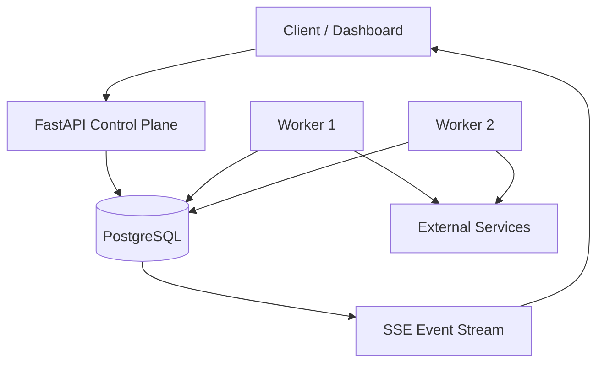

# RelayFlow

RelayFlow is a distributed workflow orchestration platform for running durable DAGs across multiple workers. It is designed as a backend-focused portfolio project that demonstrates distributed coordination, state machines, retries, idempotency, event streaming, and failure recovery.

## What it supports

- DAG workflow definitions with cycle and dependency validation
- Distributed workers using PostgreSQL row locking (`FOR UPDATE SKIP LOCKED`)
- Durable run/task state after API or worker restarts
- Automatic exponential-backoff retries
- Expiring task leases so another worker can recover abandoned work
- Idempotent workflow triggers
- Dependency fan-out and fan-in
- Run cancellation and downstream cancellation
- Server-Sent Events for real-time run updates
- HTTP, delay, and template/transform task executors
- OpenAPI documentation and a Docker Compose development environment

## Architecture



The database acts as both durable state and a transactional task queue. Workers atomically claim ready tasks with row-level locks. Each claim has a lease; if a worker crashes, the task becomes claimable after lease expiry.

## Run locally

```bash
docker compose up --build
```

Open the interactive API at `http://localhost:8000/docs`.

Create the example workflow:

```bash
curl -X POST http://localhost:8000/api/v1/workflows \
  -H 'Content-Type: application/json' \
  --data @examples/order_fulfillment.json
```

Trigger it using the returned workflow ID:

```bash
curl -X POST http://localhost:8000/api/v1/workflows/WORKFLOW_ID/runs \
  -H 'Content-Type: application/json' \
  -H 'Idempotency-Key: order-1001' \
  -d '{"input":{"order_id":1001}}'
```

Stream live events:

```bash
curl -N http://localhost:8000/api/v1/runs/RUN_ID/events
```

## API surface

| Method | Endpoint | Purpose |
|---|---|---|
| POST | `/api/v1/workflows` | Register and validate a DAG |
| GET | `/api/v1/workflows` | List workflows |
| GET | `/api/v1/workflows/{id}` | Get a workflow definition |
| POST | `/api/v1/workflows/{id}/runs` | Trigger an idempotent run |
| GET | `/api/v1/runs` | List recent runs |
| GET | `/api/v1/runs/{id}` | Inspect a run and every task |
| POST | `/api/v1/runs/{id}/cancel` | Cancel a run |
| GET | `/api/v1/runs/{id}/events` | Stream lifecycle events over SSE |

## Development without Docker

```bash
python -m venv .venv
source .venv/bin/activate
pip install -e '.[dev]'
uvicorn relayflow.main:app --reload
```

In another terminal:

```bash
source .venv/bin/activate
python -m relayflow.worker
```

SQLite is used by default for a zero-configuration demo. PostgreSQL is recommended for multiple workers because it supports safe concurrent claims with `SKIP LOCKED`.

## Interview talking points

1. **Why not an in-memory queue?** Workflow state must survive restarts, and task creation plus state updates should be transactional.
2. **How are duplicate executions handled?** Trigger idempotency protects run creation. Task handlers should also use business-level idempotency keys because distributed systems provide at-least-once execution.
3. **What if a worker dies?** Its lease expires, and another worker reclaims the task.
4. **How does DAG scheduling work?** Root tasks start ready. After task completion, blocked children become ready only when every dependency succeeds.
5. **How would it scale further?** Partition task queues, add tenant isolation, introduce Redis/Kafka wakeups while retaining PostgreSQL durability, use outbox-based event delivery, and add OpenTelemetry metrics/traces.

## Next production milestones

- JWT/RBAC and multi-tenant quotas
- Cron/event-based schedules
- Webhook callbacks and secrets vault integration
- Worker capability queues and concurrency limits
- Outbox publisher to Kafka
- React DAG editor and operations dashboard
- OpenTelemetry tracing, Prometheus metrics, and alerting

