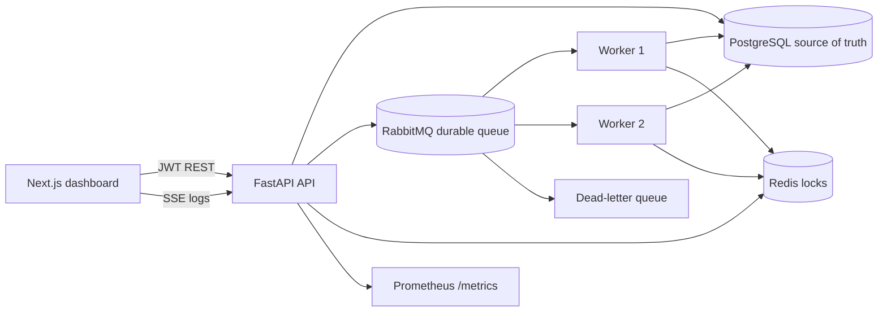

# RelayFlow architecture

## Correctness model

RelayFlow uses **at-least-once delivery**. RabbitMQ may redeliver a message, so a message is only a wake-up signal. A worker must atomically claim the PostgreSQL `task_runs` row before executing it. `SELECT ... FOR UPDATE SKIP LOCKED`, task leases and the `(run_id, task_key)` uniqueness constraint ensure only one valid attempt owns a task at a time.

HTTP tasks propagate the stable task-run ID as an `Idempotency-Key`. A downstream service that honors that key will not repeat a side effect if a worker completes the request but crashes before persisting the response.

## Failure handling

- A worker writes a lease before execution. If it crashes, another worker reclaims the task after `lease_expires_at`.
- Every attempt is stored in `task_attempts`, including worker, timing and error.
- Retry delay is `base_backoff × 2^(attempt-1)`.
- A permanently failed task is written to `dead_letter_tasks` and published to RabbitMQ's durable DLQ.
- Downstream tasks are cancelled when a dependency permanently fails.
- Redis heartbeat keys expire automatically, making offline-worker detection independent of graceful shutdown.

## Scaling to one million jobs

1. Partition `task_runs` and `run_events` by creation time or tenant.
2. Add queue sharding by workload class and region.
3. Autoscale workers using queue depth and oldest-message age.
4. Use PgBouncer and read replicas for dashboard traffic.
5. Archive terminal run events to object storage.
6. Preserve idempotency at external side-effect boundaries with task-specific keys.

## Security

Access tokens carry a role. Admins manage users and all workflows; developers create, execute and cancel; viewers have read-only access. Production deployments must replace the development JWT secret and bootstrap password.
